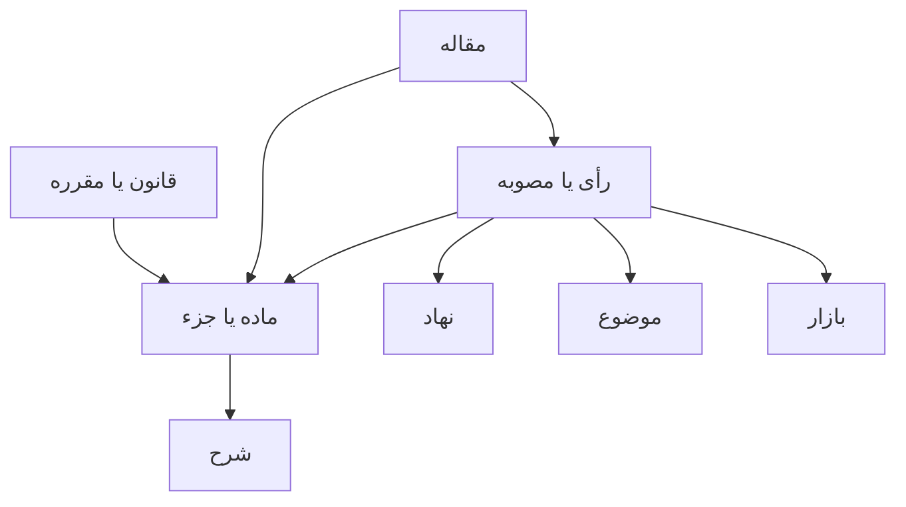

# سند تحویل پروژه رقابت‌نامه

این سند برای نادر جعفری و هر برنامه‌نویس یا هوش مصنوعی بعدی نوشته شده است. برای ادامه پروژه لازم نیست مالک سایت برنامه‌نویسی بداند. مدل بعدی باید ابتدا این سند و سپس `AI_RULES.md` را کامل بخواند.

## تعریف پروژه

رقابت‌نامه یک وبلاگ معمولی یا آرشیو جامع همه اسناد نیست. سایت یک شبکه گزینشی از محتوای مهم حقوق رقابت و تنظیم‌گری ایران است. هر سند زمانی وارد شبکه می‌شود که ارزش شرح، تفسیر، قاعده‌سازی یا اثر عملی داشته باشد.

پوشش اولیه بر دو حوزه نهادی بنا شده است

- شورای رقابت و هیئت تجدیدنظر
- سازمان تنظیم مقررات و ارتباطات رادیویی و کمیسیون تنظیم مقررات ارتباطات

حوزه نخست محتوای منتشرشده دارد. حوزه دوم در سامانه ثبت شده ولی تا زمان ورود نخستین مصوبه واقعی، هیچ صفحه عمومی خالی برای آن ساخته نمی‌شود.

## تصویر ساده معماری

هر رکورد مستقل است و با شناسه پایدار به رکوردهای دیگر وصل می‌شود



رأی فرزند یک ماده نیست و مصوبه نیز فرزند ظاهری یک نهاد نیست. هرکدام سند مستقل‌اند. رابطه‌ها تعیین می‌کنند یک سند در صفحه کدام ماده، نهاد، موضوع یا بازار دیده شود. همین اصل امکان افزودن ماده ۴۵، یک تنظیم‌گر تازه یا مقاله عمومی را بدون بازسازی سایت فراهم می‌کند.

## فناوری و انتشار

| بخش | وضعیت |
| --- | --- |
| چارچوب | Next.js با App Router |
| زبان کد | TypeScript و React |
| خروجی | فایل‌های کاملاً استاتیک در پوشه `out` |
| میزبانی | GitHub Pages |
| دامنه | `naderjafari.com` |
| استقرار | گردش‌کار `.github/workflows/pages.yml` پس از تغییر شاخه `main` |
| پایگاه داده | وجود ندارد |
| پنل مدیریت | وجود ندارد |

فایل `public/CNAME` باید باقی بماند. نشانی‌های سایت عمداً بدون اسلش پایانی ساخته می‌شوند و مقدار `trailingSlash` در `next.config.ts` نباید بدون بررسی کامل تغییر کند.

## اجزای شبکه

| نوع رکورد | کاربرد | نمونه |
| --- | --- | --- |
| `LegalSource` | قانون، آیین‌نامه، مقرره یا دستورالعمل | قانون اجرای سیاست‌های کلی اصل ۴۴ |
| `Provision` | ماده، بند، جزء یا تبصره | ماده ۴۴ و بند ۲ آن |
| `CommentaryRecord` | شرح مستقل یک جزء قانونی | شرح صدر ماده ۴۴ |
| `InstitutionalDomain` | خانواده نهادی | نظام رقابت |
| `Institution` | نهاد صادرکننده یا مرجع تجدیدنظر | شورای رقابت |
| `KnowledgeDocument` | رأی، مصوبه، مقرره یا دستورالعمل منتخب | رأی ۴۳۷ |
| `Topic` | طبقه‌بندی حقوقی | تعیین قیمت |
| `Market` | طبقه‌بندی صنعتی | ارتباطات |
| `KnowledgeArticle` | مقاله تحلیلی مستقل | هنوز منتشر نشده است |

تعریف دقیق این نوع‌ها در `lib/knowledge/types.ts` قرار دارد.

## فایل‌های مرجع

| مسیر | نقش |
| --- | --- |
| `lib/knowledge/types.ts` | قرارداد داده و انواع رابطه‌ها |
| `lib/knowledge/registry.ts` | دفتر ثبت مرکزی نهادها، قوانین، موضوعات، بازارها و اسناد |
| `lib/knowledge/article44.ts` | ساختار ماده ۴۴، نه جزء شرح و وضعیت انتشار آنها |
| `lib/knowledge/queries.ts` | پرس‌وجوهای مشترک برای ساخت خودکار صفحه‌های شبکه |
| `lib/knowledge/validate.ts` | کنترل خودکار شناسه‌های تکراری و پیوندهای شکسته هنگام بیلد |
| `content/decisions` | متن و متادیتای خام آرای منتخب |
| `content/commentary44*.md` | متن کامل شرح‌های منتشرشده ماده ۴۴ |
| `app/decision-data.ts` | خواندن فایل آرا و ساخت فهرست و لینک خودکار اشاره‌ها |
| `components/decision-page.tsx` | قالب واحد همه صفحات رأی |
| `components/article-44.tsx` | قالب متن، شرح و آرای ماده ۴۴ |
| `app/sitemap.ts` | نقشه سایت ساخته‌شده از رکوردهای واقعاً منتشرشده |
| `lib/search-index.ts` | نمایه سراسری قوانین، شرح‌ها، آرا، نهادها، موضوعات و بازارها |
| `components/site-search.tsx` | رابط جست‌وجوی سراسری که نمایه را فقط هنگام جست‌وجو بارگیری می‌کند |
| `components/decision-explorer.tsx` | جست‌وجو و فیلتر تخصصی فهرست آرای منتخب |
| `app/globals.css` | زبان بصری و واکنش‌گرایی سایت |

فایل‌های داخل `app` مسیر عمومی سایت را تعریف می‌کنند. دو گروه اصلی وجود دارد

- `(marketing)` برای صفحه اصلی، درباره و ارتباط
- `(legal)` برای قوانین، آرا و صفحه‌های شبکه حقوقی

نام گروه‌های داخل پرانتز وارد نشانی عمومی نمی‌شود.

## وضعیت فعلی محتوا

- ماده ۴۴ منتشر شده است
- شرح صدر ماده، بندهای ۱ تا ۷ و تبصره منتشر شده‌اند
- ۲۶ پرونده منتخب با نشانی‌های قبلی خود حفظ شده‌اند
- شورای رقابت و هیئت تجدیدنظر صفحه عمومی دارند چون سند منتشرشده دارند
- حوزه تنظیم‌گری ارتباطات آماده توسعه است ولی صفحه عمومی خالی ندارد
- نوع محتوای مقاله عمومی تعریف شده ولی تا ورود نخستین مقاله، صفحه آرشیو آن منتشر نمی‌شود
- جست‌وجوی سراسری در مسیر `/search` فعال است و متن کامل محتوای منتشرشده را می‌بیند
- فهرست آرای منتخب بر پایه مرجع، ماده، موضوع، بازار و نوع تصمیم فیلتر می‌شود
- شمار ۲۶ در نوار ماده ۴۴ به‌صراحت شمار کل آرای ماده است. فهرست بازشونده آرای هر شرح فقط از پیوندها و اشاره‌های واقعی همان فایل شرح ساخته می‌شود و طبقه‌بندی شبکه به‌تنهایی در آن دخالت ندارد. پرونده‌های داخلی به صفحه رقابت‌نامه و آرای فاقد صفحه داخلی به منبع بیرونی خود پیوند می‌خورند

## قواعد رابطه‌ها

`ProvisionLink` رابطه یک سند با ماده یا جزء را نگه می‌دارد. معنای هر رابطه باید دقیق رعایت شود

| رابطه | کاربرد |
| --- | --- |
| `commentary-reference` | شرح نویسنده به آن سند اشاره کرده است |
| `applies` | خود سند آن مقرره را اعمال کرده است |
| `interprets` | سند مقرره را تفسیر کرده است |
| `cites` | سند صرفاً به مقرره استناد یا اشاره کرده است |
| `concerns` | ارتباط عمومی و محتاطانه وجود دارد |

وجود نام یک رأی در شرح به‌تنهایی به معنی اعمال یا تفسیر ماده نیست. در وضعیت فعلی بسیاری از پیوندها عمداً با `commentary-reference` ثبت شده‌اند تا ادعای حقوقی بیش از متن ساخته نشود.

`DocumentLink` رابطه میان دو سند را ثبت می‌کند. مانند تجدیدنظر از، تأیید، نقض، اصلاح یا نسخ. این رابطه فقط با شاهد روشن در متن یا داده منبع ثبت می‌شود.

## افزودن یک رأی شورای رقابت

۱. یک فایل متنی جدید در `content/decisions` قرار دهید.

۲. سرآیند فایل باید همان کلیدهای فایل‌های موجود را حفظ کند. مهم‌ترین کلیدها شامل عنوان، مرجع، شماره جلسه یا رأی، تاریخ، نوع تصمیم، قاعده و دلیل انتخاب، نتیجه واقعی، احتیاط پژوهشی و نشانی رسمی هستند.

۳. میان سرآیند و متن کامل از خط جداکننده مشابه فایل‌های موجود استفاده کنید.

۴. یک رکورد با شناسه و اسلاگ یکتا در آرایه `documents` داخل `lib/knowledge/registry.ts` اضافه کنید.

۵. نهاد صادرکننده، اجزای قانونی، موضوعات و بازارها را با شناسه‌های موجود پیوند دهید. اگر رابطه دقیق معلوم نیست از نسبت قوی‌تر مانند `applies` استفاده نکنید.

۶. نیازی به ساخت دستی صفحه، کارت، لینک نهاد یا لینک موضوع نیست. مسیر `/decisions/[slug]` و پرس‌وجوهای شبکه آن را خودکار می‌سازند.

۷. `npm run build` را اجرا کنید و خروجی را بررسی کنید.

اگر شناسه‌ای تکراری یا یک پیوند شبکه‌ای شکسته باشد، کنترل یکپارچگی بیلد را متوقف می‌کند تا خطا به سایت زنده نرسد.

## افزودن شرح یک بند جدید

۱. متن نهایی را در فایلی مانند `content/commentary44-clause-3.md` قرار دهید.

۲. در `lib/knowledge/article44.ts` مقدار `available` همان بخش را به `true` تغییر دهید.

۳. نام فایل به‌صورت خودکار از اسلاگ ساخته می‌شود. فقط صدر ماده استثناست و از `commentary44.md` استفاده می‌کند.

۴. پس از بیلد، صفحه شرح، لینک متن ماده، ناوبری اجزا و نقشه سایت خودکار فعال می‌شوند.

۵. متن حقوقی نباید هنگام انتقال خلاصه، بازنویسی یا اصلاح محتوایی شود مگر نادر جعفری صریحاً چنین بخواهد.

## افزودن نخستین مصوبه تنظیم‌گری ارتباطات

ساختار داده آماده است ولی قالب عمومی مصوبه باید هنگام ورود نخستین متن واقعی تکمیل شود

۱. فایل مصوبه در پوشه محتوایی مستقل مانند `content/resolutions` قرار می‌گیرد.

۲. یک `KnowledgeDocument` با نوع `resolution` و نهاد صادرکننده درست ثبت می‌شود.

۳. اگر صفحه جزئیات مصوبه هنوز وجود ندارد، یک قالب عمومی مشابه صفحه رأی ساخته می‌شود که متادیتای مناسب مصوبه را می‌خواند.

۴. وضعیت نهاد و حوزه تنظیم‌گری ارتباطات از `draft` به `published` تغییر می‌کند.

۵. تنها پس از وجود دست‌کم یک مصوبه واقعی، صفحه آن نهاد و مسیر آرشیو مصوبات وارد خروجی و نقشه سایت می‌شود.

## افزودن نهاد جدید

ابتدا حوزه نهادی و نهاد در `registry.ts` با وضعیت `draft` ثبت می‌شوند. تا زمانی که محتوای واقعی برای نهاد وجود نداشته باشد نباید آن را `published` کرد. صفحه‌های فهرست از روی پرس‌وجوها ساخته می‌شوند و نهاد بدون سند را نشان نمی‌دهند.

## افزودن مقاله عمومی

مقاله یک محتوای مستقل است و در `KnowledgeArticle` می‌تواند همزمان به مواد، اسناد، نهادها، موضوعات و بازارها متصل شود. نخستین بار که مقاله واقعی وارد می‌شود باید قالب ثابت مقاله و مسیر آرشیو آن ساخته شود. پیش از آن، صفحه خالی مقاله لازم نیست.

## سئو و نشانی‌ها

- نشانی‌های فعلی ماده ۴۴ و ۲۶ رأی باید پایدار بمانند
- متادیتای هر صفحه در فایل مسیر همان صفحه ساخته می‌شود
- `app/sitemap.ts` فقط رکوردهای `published` را وارد نقشه سایت می‌کند
- صفحات پیش‌نویس نباید در نقشه سایت یا خروجی عمومی باشند
- `public/robots.txt` به نقشه سایت دامنه اصلی اشاره می‌کند
- دامنه مرجع در `app/layout.tsx` برابر `https://naderjafari.com` است
- از ساخت دو صفحه با محتوای یکسان و نشانی متفاوت خودداری شود
- مسیر `/search` عمداً `noindex` است تا صفحه‌های نتایج جست‌وجو وارد گوگل نشوند

## طراحی

- هویت اصلی سرمه‌ای بسیار تیره با طلایی محدود است
- Estedad برای تیترها و Vazirmatn برای متن استفاده می‌شود
- عددهای نمایشی فارسی‌اند
- تاریخ‌های سایت به ترتیب سال، ماه و روز نمایش داده می‌شوند. ترتیب متفاوت مورد استفاده در Word به سایت منتقل نمی‌شود
- عکس تنها زمانی افزوده می‌شود که ارزش معنایی یا بصری واقعی داشته باشد
- قالب صفحات هم‌نوع باید یکسان بماند
- موبایل و دسکتاپ هر دو باید پس از تغییر بررسی شوند

## کنترل پیش از انتشار

این فرمان باید بدون خطا تمام شود

```bash
npm install
npm run build
```

سپس دست‌کم این موارد کنترل می‌شوند

- صفحه اصلی
- صفحه قوانین
- متن ماده ۴۴
- هر شرح تازه
- فهرست آرا و یک رأی نمونه
- صفحات نهاد، موضوع و بازار مرتبط
- `sitemap.xml`
- نبود صفحه عمومی برای رکوردهای پیش‌نویس
- نبود اسلش پایانی در لینک‌های داخلی

## بازیابی و ادامه توسط مدل دیگر

مدل جدید باید کار را با این ترتیب شروع کند

۱. `PROJECT_GUIDE.md` را کامل بخواند

۲. `AI_RULES.md` را کامل بخواند

۳. وضعیت گیت و شاخه فعال را بررسی کند

۴. فایل‌های `types.ts`، `registry.ts` و `queries.ts` را پیش از هر تغییر معماری بخواند

۵. تغییر را محدود و قابل بازگشت انجام دهد

۶. بیلد کامل بگیرد و مسیرهای موجود را کنترل کند

دانش اصلی پروژه اکنون داخل خود مخزن ثبت شده است و برای ادامه به حافظه یک گفت‌وگوی خاص وابسته نیست.
